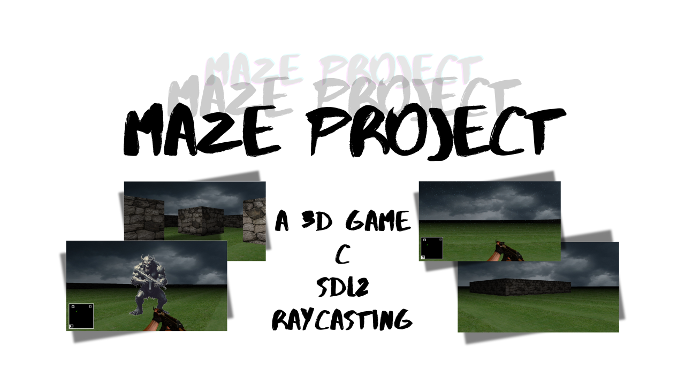

# 3D Maze Game

## Table of contents
- [Overview](#overview)
   - [About the game](#about-the-game)
   - [Screenshots](#screenshots)
   - [Features](#features)
   - [Game links](#game-links)
   - [Author links](#author-links)
- [Technologies Employed in the Project](#technologies-employed-in-the-project)
- [Core Architecture of the Game](#core-architecture-of-the-game)
- [Installation](#installation)
- [Usage](#usage)
   - [Launching the Game](#launching-the-Game)
   - [Controls (keyboard)](#controls-keyboard)
- [Contributing](#contributing)
- [Related projects](#related-projects)
   - [Simple Shell](#simple-shell)
- [Licensing](#licensing)
## Overview
### About the game
**3D Maze Game:** is a first-person maze exploration adventure that employs raycasting to create a 3D environment from a 2D map. Developed using SDL2 (Simple DirectMedia Layer 2) and the C programming language, it delivers a retro-style visual experience that harks back to the early days of 3D gaming.
### Screenshots


### Features
- **Seamlessly switch weapons:** Use the number keys 1 and 3 to quickly switch between your weapons.
- **Customizable rain effects:** Hit 'R' to turn the rain on or off.
- **Map display:** Tap 'M' to reveal the map.
### Game links
- [A demo of the game](https://www.youtube.com/watch?v=KR5ChggmYI0)
- [LinkedIn article](https://www.linkedin.com/pulse/navigating-my-development-journey-building-3d-maze-game-ismail-aqzie/)
- [Landing page](https://mi7773.github.io/landing_page/)
### Author links
   - **Mahmoud Ismail:**
      - [X](https://x.com/mi7773)
      - [LinkedIn](https://www.linkedin.com/in/mi7773/)
      - [Discord](https://discordapp.com/users/1106153071706394677)
      - [GitHub](https://github.com/mi7773)
## Technologies Employed in the Project

## Core Architecture of the Game

## Installation
To install 3D Maze Game, follow these steps:
1. **Clone the repository:**
   - On Ubuntu:
      - Clone the repository:
         ```bash
         git clone https://github.com/mi7773/maze_project.git
         ```
      - Change directory into the project folder:
        ```bash
        cd maze_project
        ```
2. **Install libsdl2-dev and libsdl2-image-dev:**
   - On Ubuntu:
      - First, check if libsdl2-dev and libsdl2-image-dev are installed:
         ```bash
         dpkg -l | grep libsdl2-dev
         dpkg -l | grep libsdl2-image-dev
         ```
      - If they are not installed, install them using:
         ```bash
         sudo apt-get update
         sudo apt-get install libsdl2-dev libsdl2-image-dev
         ```
3. **Install gcc:**
   - On Ubuntu:
      - First, check if gcc is installed:
         ```bash
         gcc --version
         ```
      - If it is not installed, install it using:
         ```bash
         sudo apt-get update
         sudo apt-get install gcc
         ```
4. **Build the Game**
   - On Ubuntu:
      - Compile the project using gcc:
         ```bash
         gcc -Wall -Werror -Wextra -pedantic -g src/*.c -o maze `sdl2-config --cflags --libs` -lm -lSDL2_image
         ```
## Usage
### Launching the Game
To play the game, run the compiled binary:
- **Run the default map** (`maps/map2.txt`):
   ```bash
   ./maze
   ```
- **Select a different map** (e.g., `maps/map1.txt`):
   ```bash
   ./maze maps/map1.txt
   ```
The game will load and render the selected map file. Make sure the map files are located in the `maps/` directory.
### Controls (keyboard)
The game supports multiple key inputs simultaneously. For instance, pressing `w` and `s` at the same time will cancel out movement.
- **Movement:**
  - `w`: Move forward
  - `s`: Move backward
  - `a`: Strafe left
  - `d`: Strafe right
- **Speed:**
  - `Left Shift`: Increase movement speed
- **Rotation:**
  - `e`: Rotate right
  - `q`: Rotate left
- **Weapon Switching:**
  - `1` / `3`: Switch between weapons
- **Map Display:**
  - `m`: Toggle map visibility
- **Rain Effects:**
  - `r`: Toggle rain effects on/off
## Contributing
We appreciate and welcome contributions! To get involved, follow these steps:
1. **Fork the repository to your GitHub account.**
2. **Create a new feature branch:**
   ```bash
   git checkout -b feature/YourFeature
   ```
3. **Commit your changes with a descriptive message:**
   ```bash
   git commit -m "Add YourFeature"
   ```
4. **Push the branch to your forked repository:**
   ```bash
   git push origin feature/YourFeature
   ```
5. **Open a Pull Request to the main repository for review.**

For more detailed guidelines on contributing, please refer to our [Contributing Guide.](CONTRIBUTING.md)
## Related Projects
### [Simple Shell](https://github.com/mi7773/simple_shell)
A straightforward UNIX command interpreter. This project provides a minimal implementation of a shell, demonstrating core functionalities such as command execution and handling of standard input and output.
## Licensing
You are welcome to explore, modify, and share this project freely! While it's not mandatory, acknowledging the original creators is appreciated.
